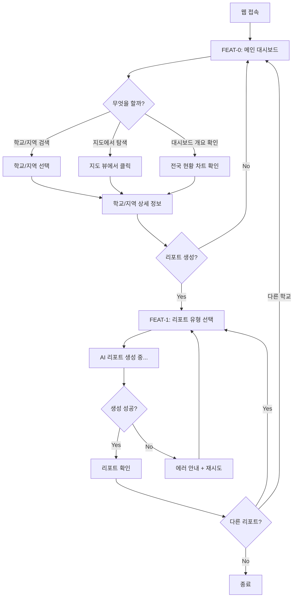
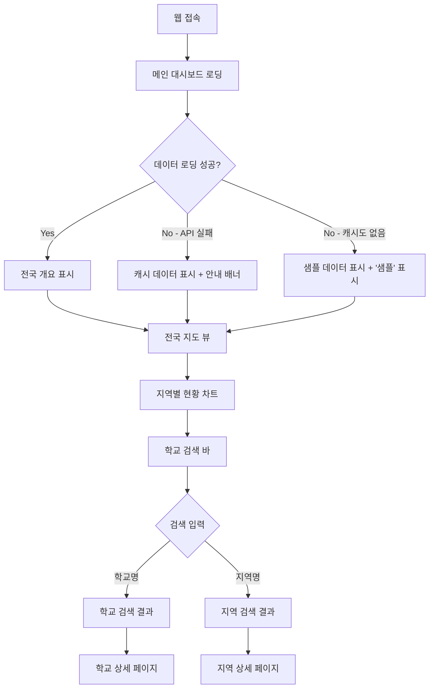
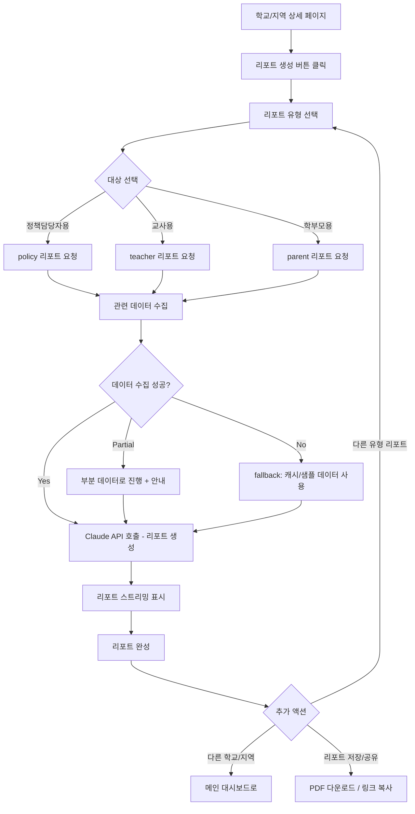
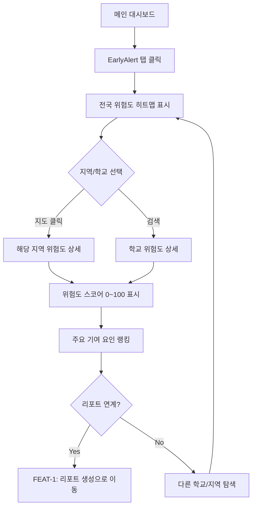
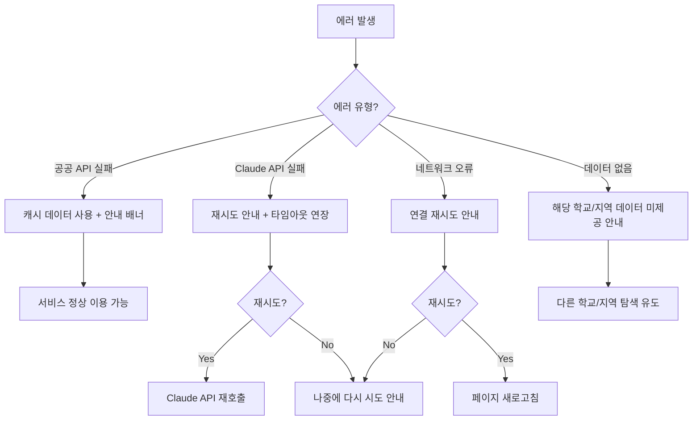

# User Flow (사용자 흐름도) — 에듀맵 (EduMap)

> Mermaid 플로우차트로 핵심 기능의 주요 여정을 표현합니다.

---

## MVP 캡슐

| # | 항목 | 내용 |
|---|------|------|
| 1 | 목표 | 교육 공공데이터를 AI로 분석하여 학습격차를 조기 탐지하고, 누구나 이해할 수 있는 자연어 리포트를 자동 생성하여 대회 수상 |
| 2 | 페르소나 | 교육청 정책담당자, 학교 교사, 학부모 |
| 3 | 핵심 기능 | FEAT-1: InsightReport (AI 자연어 리포트 생성) |
| 4 | 성공 지표 (노스스타) | 대회 심사위원 평가 — 수상 |
| 5 | 입력 지표 | AI 리포트 품질 점수, 데이터 통합 정확도 |
| 6 | 비기능 요구 | 공공 API 응답 실패 시 fallback 처리 |
| 7 | Out-of-scope | 수익화, 모바일 앱, 개인 학생 데이터, 사용자 인증 |
| 8 | Top 리스크 | 공공데이터 API 불안정 |
| 9 | 완화/실험 | 로컬 캐시 + 샘플 데이터로 데모 대비 |
| 10 | 다음 단계 | 학교알리미 API 연동 및 데이터 수집 |

---

## 1. 전체 사용자 여정 (Overview)

---

## 2. FEAT-0: 메인 대시보드 플로우

---

## 3. FEAT-1: InsightReport — AI 리포트 생성 플로우

---

## 4. FEAT-2: EarlyAlert — 조기경보 플로우 (Phase 2)

---

## 5. 에러 처리 플로우

---

## 6. 화면 목록 (Screen Inventory)

| 화면 ID | 화면명 | FEAT | 진입점 | 주요 액션 |
|---------|--------|------|--------|----------|
| S-01 | 메인 대시보드 | FEAT-0 | 웹 접속 | 전국 개요 확인, 검색, 지도 탐색 |
| S-02 | 학교 상세 | FEAT-0 | S-01 검색/지도 클릭 | 학교 정보 확인, 리포트 생성 진입 |
| S-03 | 지역 상세 | FEAT-0 | S-01 검색/지도 클릭 | 지역 현황 확인, 리포트 생성 진입 |
| S-04 | 리포트 유형 선택 | FEAT-1 | S-02, S-03 | policy/teacher/parent 선택 |
| S-05 | 리포트 생성 중 | FEAT-1 | S-04 | 스트리밍 리포트 표시, 로딩 상태 |
| S-06 | 리포트 결과 | FEAT-1 | S-05 | 리포트 확인, PDF 다운로드, 다른 유형 선택 |
| S-07 | EarlyAlert 대시보드 | FEAT-2 | S-01 탭 | 위험도 히트맵, 학교/지역 선택 (Phase 2) |
| S-08 | GapMap 지도 | FEAT-3 | S-01 탭 | 자원 공백 지도, 추천 경로 (Phase 3) |

---

## Decision Log 참조

| ID | 항목 | 선택 | 근거 |
|----|------|------|------|
| D-06 | 인증 | 없음 | 대회 데모에서 빠른 접근이 중요, 로그인 플로우 제외 |
| D-03 | 사용환경 | 웹 전용 | 대회 데모에 최적화, 모바일 고려 불필요 |
