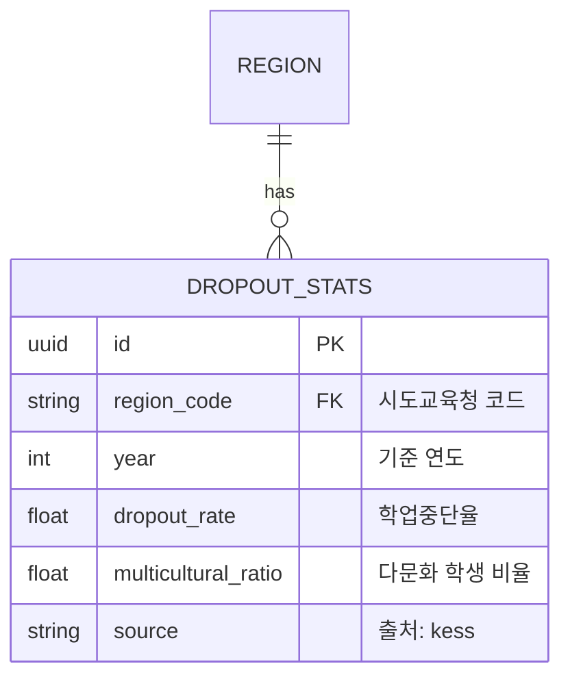
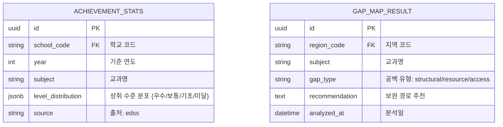

# Database Design (데이터베이스 설계) — 에듀맵 (EduMap)

> Mermaid ERD로 주요 엔티티와 관계를 표현합니다.
> 학교 코드를 기준 키로 모든 데이터셋을 조인합니다.
> 학생 개인정보는 절대 저장하지 않으며, 학교 단위 집계 데이터만 사용합니다.

---

## MVP 캡슐

| # | 항목 | 내용 |
|---|------|------|
| 1 | 목표 | 교육 공공데이터를 AI로 분석하여 학습격차를 조기 탐지하고, 누구나 이해할 수 있는 자연어 리포트를 자동 생성하여 대회 수상 |
| 2 | 페르소나 | 교육청 정책담당자, 학교 교사, 학부모 |
| 3 | 핵심 기능 | FEAT-1: InsightReport (AI 자연어 리포트 생성) |
| 4 | 성공 지표 (노스스타) | 대회 심사위원 평가 — 수상 |
| 5 | 입력 지표 | AI 리포트 품질 점수, 데이터 통합 정확도 |
| 6 | 비기능 요구 | 공공 API 응답 실패 시 fallback 처리 |
| 7 | Out-of-scope | 수익화, 모바일 앱, 개인 학생 데이터, 사용자 인증 |
| 8 | Top 리스크 | 공공데이터 API 불안정 |
| 9 | 완화/실험 | 로컬 캐시 + 샘플 데이터로 데모 대비 |
| 10 | 다음 단계 | 학교알리미 API 연동 및 데이터 수집 |

---

## 1. ERD (Entity Relationship Diagram)

```mermaid
erDiagram
    %% FEAT-0: 학교 기본 정보 (기준 키: school_code)
    SCHOOL {
        string school_code PK "학교 코드 (학교알리미 기준)"
        string school_name "학교명"
        string school_type "학교급: elementary/middle/high"
        string region_code FK "시도교육청 코드"
        string district "시군구"
        float latitude "위도"
        float longitude "경도"
        string address "주소"
        datetime data_updated_at "데이터 갱신일"
    }

    %% FEAT-0: 지역 정보
    REGION {
        string region_code PK "시도교육청 코드"
        string region_name "시도명"
        string sub_region "시군구"
    }

    %% FEAT-2: 교원 현황 (학교알리미)
    TEACHER_STATS {
        uuid id PK
        string school_code FK "학교 코드"
        int year "기준 연도"
        float students_per_teacher "교원 1인당 학생 수 (교원1인당학생수)"
        float temp_teacher_ratio "기간제 교원 비율 (기간제교원비율)"
        int total_teachers "전체 교원 수"
        int total_students "전체 학생 수"
        string source "출처: schoolinfo"
        datetime collected_at "수집일"
    }

    %% FEAT-2: 재정 현황 (학교알리미)
    FINANCE_STATS {
        uuid id PK
        string school_code FK "학교 코드"
        int year "기준 연도"
        bigint total_budget "총 예산 (세입결산총액)"
        bigint education_budget "교육활동비"
        float budget_per_student "학생 1인당 교육비"
        string source "출처: schoolinfo"
        datetime collected_at "수집일"
    }

    %% FEAT-2/3: 방과후 프로그램 (학교알리미)
    AFTERSCHOOL_PROGRAM {
        uuid id PK
        string school_code FK "학교 코드"
        int year "기준 연도"
        string subject "과목명 (프로그램명)"
        int enrollment "수강 인원 (수강인원수)"
        string category "분류: academic/art/sports/etc"
        string source "출처: schoolinfo"
        datetime collected_at "수집일"
    }

    %% FEAT-2: 위험도 스코어 (EarlyAlert 산출)
    RISK_SCORE {
        uuid id PK
        string school_code FK "학교 코드"
        int year "기준 연도"
        float score "위험도 스코어 (0~100)"
        jsonb contributing_factors "기여 요인 랭킹 [{factor, weight, value}]"
        datetime calculated_at "산출일"
    }

    %% FEAT-1: AI 리포트 캐시
    REPORT_CACHE {
        uuid id PK
        string school_code FK "학교 코드 (NULL이면 지역 리포트)"
        string region_code FK "지역 코드 (NULL이면 학교 리포트)"
        string report_type "유형: policy/teacher/parent"
        text report_content "AI 생성 리포트 본문"
        string model_used "사용된 AI 모델 (claude-opus-4-5 등)"
        jsonb input_data_summary "입력 데이터 요약"
        datetime generated_at "생성일"
        datetime expires_at "만료일"
    }

    %% FEAT-0: API 응답 캐시
    API_CACHE {
        uuid id PK
        string api_source "API 소스: schoolinfo/neis/kess"
        string request_key "요청 식별키 (URL + 파라미터 해시)"
        jsonb response_data "응답 데이터"
        datetime cached_at "캐시 저장일"
        datetime expires_at "만료일"
    }

    %% 관계 정의
    REGION ||--o{ SCHOOL : "contains"
    SCHOOL ||--o{ TEACHER_STATS : "has"
    SCHOOL ||--o{ FINANCE_STATS : "has"
    SCHOOL ||--o{ AFTERSCHOOL_PROGRAM : "has"
    SCHOOL ||--o{ RISK_SCORE : "has"
    SCHOOL ||--o{ REPORT_CACHE : "has"
    REGION ||--o{ REPORT_CACHE : "has"
```

---

## 2. 엔티티 상세 정의

### 2.1 SCHOOL (학교) - FEAT-0 (기준 엔티티)

| 컬럼 | 타입 | 제약조건 | 설명 |
|------|------|----------|------|
| school_code | VARCHAR(20) | PK | 학교알리미 학교 코드 (고유) |
| school_name | VARCHAR(100) | NOT NULL | 학교명 |
| school_type | VARCHAR(20) | NOT NULL | 학교급: elementary/middle/high |
| region_code | VARCHAR(10) | FK → REGION, NOT NULL | 시도교육청 코드 |
| district | VARCHAR(50) | NOT NULL | 시군구 |
| latitude | FLOAT | NULL | 위도 (지도 표시용) |
| longitude | FLOAT | NULL | 경도 (지도 표시용) |
| address | VARCHAR(300) | NULL | 주소 |
| data_updated_at | TIMESTAMP | NOT NULL | 데이터 갱신일 |

**인덱스:**
- `idx_school_region` ON region_code
- `idx_school_type` ON school_type
- `idx_school_name` ON school_name (검색용)
- `idx_school_geo` ON (latitude, longitude)

### 2.2 TEACHER_STATS (교원 현황) - FEAT-2

| 컬럼 | 타입 | 제약조건 | 설명 |
|------|------|----------|------|
| id | UUID | PK | 고유 식별자 |
| school_code | VARCHAR(20) | FK → SCHOOL, NOT NULL | 학교 코드 |
| year | INTEGER | NOT NULL | 기준 연도 |
| students_per_teacher | FLOAT | NULL | 교원 1인당 학생 수 |
| temp_teacher_ratio | FLOAT | NULL | 기간제 교원 비율 (0~1) |
| total_teachers | INTEGER | NULL | 전체 교원 수 |
| total_students | INTEGER | NULL | 전체 학생 수 |
| source | VARCHAR(50) | NOT NULL, DEFAULT 'schoolinfo' | 출처 |
| collected_at | TIMESTAMP | NOT NULL, DEFAULT NOW() | 수집일 |

**인덱스:**
- `idx_teacher_school_year` ON (school_code, year) UNIQUE
- `idx_teacher_year` ON year

### 2.3 REPORT_CACHE (AI 리포트 캐시) - FEAT-1

| 컬럼 | 타입 | 제약조건 | 설명 |
|------|------|----------|------|
| id | UUID | PK | 고유 식별자 |
| school_code | VARCHAR(20) | FK → SCHOOL, NULL | 학교 코드 (지역 리포트 시 NULL) |
| region_code | VARCHAR(10) | FK → REGION, NULL | 지역 코드 (학교 리포트 시 NULL) |
| report_type | VARCHAR(20) | NOT NULL | 유형: policy/teacher/parent |
| report_content | TEXT | NOT NULL | AI 생성 리포트 본문 |
| model_used | VARCHAR(50) | NOT NULL | 사용된 AI 모델명 |
| input_data_summary | JSONB | NULL | 입력 데이터 요약 (재생성 판단용) |
| generated_at | TIMESTAMP | NOT NULL, DEFAULT NOW() | 생성일 |
| expires_at | TIMESTAMP | NOT NULL | 만료일 |

**인덱스:**
- `idx_report_school_type` ON (school_code, report_type)
- `idx_report_region_type` ON (region_code, report_type)
- `idx_report_expires` ON expires_at

---

## 3. 관계 정의

| 부모 | 자식 | 관계 | 설명 |
|------|------|------|------|
| REGION | SCHOOL | 1:N | 한 지역에 여러 학교 |
| SCHOOL | TEACHER_STATS | 1:N | 연도별 교원 현황 |
| SCHOOL | FINANCE_STATS | 1:N | 연도별 재정 현황 |
| SCHOOL | AFTERSCHOOL_PROGRAM | 1:N | 연도별 방과후 프로그램 목록 |
| SCHOOL | RISK_SCORE | 1:N | 연도별 위험도 스코어 |
| SCHOOL | REPORT_CACHE | 1:N | 학교별 AI 리포트 |
| REGION | REPORT_CACHE | 1:N | 지역별 AI 리포트 |

---

## 4. 데이터 생명주기

| 엔티티 | 생성 시점 | 보존 기간 | 갱신 주기 |
|--------|----------|----------|----------|
| SCHOOL | 데이터 수집 스크립트 | 영구 | 연 1회 (학교알리미 갱신 시) |
| REGION | 초기 시드 데이터 | 영구 | 거의 변경 없음 |
| TEACHER_STATS | 데이터 수집 스크립트 | 영구 (연도별) | 연 1회 |
| FINANCE_STATS | 데이터 수집 스크립트 | 영구 (연도별) | 연 1회 |
| AFTERSCHOOL_PROGRAM | 데이터 수집 스크립트 | 영구 (연도별) | 연 1회 |
| RISK_SCORE | EarlyAlert 분석 실행 | 영구 (연도별) | 데이터 갱신 시 재계산 |
| REPORT_CACHE | 사용자 리포트 요청 | 만료 후 삭제 (7일) | 요청 시 생성 |
| API_CACHE | 공공 API 호출 | 만료 후 삭제 (7일) | API 호출 시 갱신 |

---

## 5. 확장 고려사항

### 5.1 Phase 2에서 추가 예정

### 5.2 Phase 3에서 추가 예정

### 5.3 인덱스 전략

- **읽기 최적화**: school_code, region_code, year 조합으로 자주 조회
- **지도 렌더링**: latitude/longitude 복합 인덱스로 지역별 빠른 조회
- **리포트 캐시**: school_code + report_type 복합 인덱스로 중복 방지

---

## Decision Log 참조

| ID | 항목 | 선택 | 근거 |
|----|------|------|------|
| D-13 | 데이터 저장 | 파일 기반 + 클라우드 DB | 공공데이터 CSV 수집 → Supabase PostgreSQL 적재 |
| D-21 | DB | PostgreSQL (Supabase) | 무료 티어, 웹 대시보드, Prisma 연동 |
