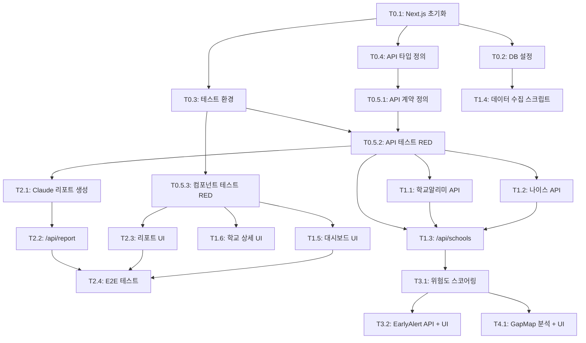

# TASKS: 에듀맵 (EduMap) - AI 개발 파트너용 태스크 목록

## MVP 캡슐

1. **목표**: 교육 공공데이터를 AI로 분석하여 학습격차를 조기 탐지하고, 누구나 이해할 수 있는 자연어 리포트를 자동 생성하여 대회 수상
2. **페르소나**: 교육청 정책담당자, 학교 교사, 학부모
3. **핵심 기능**: FEAT-1: InsightReport (AI 자연어 리포트 생성)
4. **성공 지표 (노스스타)**: 대회 심사위원 평가 — 수상
5. **입력 지표**: AI 리포트 품질 점수, 데이터 통합 정확도
6. **비기능 요구**: 공공 API 응답 실패 시 fallback 처리
7. **Out-of-scope**: 수익화, 모바일 앱, 개인 학생 데이터, 사용자 인증
8. **Top 리스크**: 공공데이터 API 불안정 / EDSS 데이터 심사 기간 지연
9. **완화/실험**: 로컬 캐시 + 샘플 데이터로 데모 대비
10. **다음 단계**: 학교알리미 API 연동 및 데이터 수집

---

## 마일스톤 개요

| 마일스톤 | 설명 | 주요 기능 | Phase |
|----------|------|----------|-------|
| M0 | 프로젝트 셋업 | Next.js 초기화, DB 설정, 기본 구조 | Phase 0 |
| M0.5 | 계약 & 테스트 설계 | API 계약 정의, 테스트 선행 작성 | Phase 0 |
| M1 | FEAT-0 메인 대시보드 | 전국 개요, 지도 뷰, 학교 검색 | Phase 1 |
| M2 | FEAT-1 InsightReport | Claude API 연동, 대상별 리포트 생성 | Phase 2 |
| M3 | FEAT-2 EarlyAlert | 위험도 스코어링, 히트맵 (Phase 2 기능) | Phase 3 |
| M4 | FEAT-3 GapMap | 학습자원 공백 지도 (Phase 3 기능) | Phase 4 |

---

## M0: 프로젝트 셋업

### [] Phase 0, T0.1: Next.js 프로젝트 초기화

**담당**: frontend-specialist

**작업 내용**:
- Next.js 14+ (App Router) + TypeScript 프로젝트 생성
- Tailwind CSS 설정 (Design System 컬러 반영)
- ESLint + Prettier 설정
- `.env.example` 생성 (SCHOOLINFO_API_KEY, NEIS_API_KEY, ANTHROPIC_API_KEY, DATABASE_URL, DIRECT_URL)
- `.gitignore` 설정 (.env.local 포함)

**산출물**:
- `package.json`
- `tsconfig.json`
- `tailwind.config.ts` (Design System 컬러: primary, risk 등)
- `src/app/layout.tsx` (루트 레이아웃)
- `src/app/page.tsx` (메인 페이지 스켈레톤)
- `.env.example`
- `.gitignore`

**완료 조건**:
- [ ] `npm run dev` 정상 실행
- [ ] `npm run lint` 에러 없음
- [ ] `npm run type-check` (tsc --noEmit) 에러 없음
- [ ] Tailwind CSS 컬러 토큰이 Design System과 일치

---

### [] Phase 0, T0.2: 데이터베이스 설정 (Supabase + Prisma)

**담당**: database-specialist

**작업 내용**:
- Prisma 설치 및 초기 설정
- `04-database-design.md` 기반 스키마 작성 (MVP 엔티티: REGION, SCHOOL, TEACHER_STATS, FINANCE_STATS, AFTERSCHOOL_PROGRAM, REPORT_CACHE, API_CACHE)
- Supabase 연결 설정
- 초기 마이그레이션 실행
- 시드 데이터 스크립트 스켈레톤 생성

**산출물**:
- `prisma/schema.prisma`
- `src/lib/db/prisma.ts` (Prisma 클라이언트 싱글톤)
- `scripts/seed-data.ts` (스켈레톤)

**완료 조건**:
- [ ] `npx prisma generate` 성공
- [ ] `npx prisma db push` 성공 (Supabase 연결)
- [ ] Prisma Client 타입 생성 확인

---

### [] Phase 0, T0.3: 테스트 환경 설정

**담당**: test-specialist

**작업 내용**:
- Vitest 설치 및 Next.js 호환 설정
- React Testing Library 설정
- MSW (Mock Service Worker) 설정
- Playwright 설치 및 기본 설정
- 테스트 디렉토리 구조 생성

**산출물**:
- `vitest.config.ts`
- `playwright.config.ts`
- `src/__tests__/setup.ts` (테스트 전역 설정)
- `src/mocks/server.ts` (MSW 서버 설정)
- `src/mocks/handlers/index.ts` (핸들러 인덱스)

**완료 조건**:
- [ ] `npm run test` 실행 가능 (샘플 테스트 통과)
- [ ] `npx playwright test` 실행 가능
- [ ] MSW 서버 정상 동작 확인

---

### [] Phase 0, T0.4: 공공데이터 API 타입 정의

**담당**: backend-specialist

**작업 내용**:
- 학교알리미 API 응답 타입 정의 (한글 원본 명칭 주석 병기)
- 나이스 API 응답 타입 정의
- 공통 학교/지역 타입 정의
- Zod 스키마 정의 (API 응답 검증용)
- 리포트 관련 타입 정의 (report_type: policy/teacher/parent)

**산출물**:
- `src/types/school.ts` (학교/지역 타입)
- `src/types/report.ts` (리포트 타입)
- `src/types/api-responses.ts` (공공 API 응답 타입)
- `src/lib/api/types.ts` (Zod 스키마)

**완료 조건**:
- [ ] 모든 공공 API 응답 필드에 한글 원본 명칭 주석
- [ ] Zod 스키마로 샘플 데이터 파싱 성공
- [ ] `npm run type-check` 에러 없음

---

## M0.5: 계약 & 테스트 설계

### [] Phase 0, T0.5.1: API Route 계약 정의

**담당**: backend-specialist

**작업 내용**:
- `/api/schools` 엔드포인트 계약 (학교 목록/검색/상세 조회)
- `/api/report` 엔드포인트 계약 (AI 리포트 생성)
- `/api/early-alert` 엔드포인트 계약 (위험도 스코어 — Phase 2)
- 요청/응답 Zod 스키마 정의
- 에러 응답 형식 정의 (TRD 섹션 8.2 참조)

**산출물**:
- `src/lib/api/contracts/schools.ts` (학교 API 계약)
- `src/lib/api/contracts/report.ts` (리포트 API 계약)
- `src/lib/api/contracts/early-alert.ts` (위험도 API 계약)

**완료 조건**:
- [ ] 모든 API 엔드포인트의 요청/응답 타입 정의
- [ ] Zod 스키마로 계약 검증 가능
- [ ] 에러 응답 형식 통일

---

### [] Phase 0, T0.5.2: API Route 테스트 작성 (RED)

**담당**: test-specialist

**작업 내용**:
- `/api/schools` 테스트 작성 (학교 목록 조회, 검색, 상세)
- `/api/report` 테스트 작성 (리포트 생성 요청, 타입별 분기)
- MSW 핸들러로 공공 API / Claude API Mock 설정
- 모든 테스트가 **실패(RED)** 상태 확인

**산출물**:
- `src/__tests__/api/schools.test.ts`
- `src/__tests__/api/report.test.ts`
- `src/mocks/handlers/schoolinfo.ts` (학교알리미 API Mock)
- `src/mocks/handlers/neis.ts` (나이스 API Mock)
- `src/mocks/handlers/claude.ts` (Claude API Mock)
- `src/mocks/data/schools.ts` (학교 샘플 데이터)

**완료 조건**:
- [ ] 모든 테스트가 실패(RED) 상태 — 아직 구현 없음
- [ ] MSW Mock 핸들러가 공공 API 응답 구조와 일치
- [ ] Mock 데이터에 한글 원본 필드명 주석 포함

---

### [] Phase 0, T0.5.3: 컴포넌트 테스트 작성 (RED)

**담당**: test-specialist

**작업 내용**:
- SchoolCard 컴포넌트 테스트
- ReportViewer 컴포넌트 테스트
- RiskScoreBadge 컴포넌트 테스트
- SearchBar 컴포넌트 테스트
- 모든 테스트가 **실패(RED)** 상태 확인

**산출물**:
- `src/__tests__/components/SchoolCard.test.tsx`
- `src/__tests__/components/ReportViewer.test.tsx`
- `src/__tests__/components/RiskScoreBadge.test.tsx`
- `src/__tests__/components/SearchBar.test.tsx`

**완료 조건**:
- [ ] 모든 컴포넌트 테스트가 실패(RED) 상태
- [ ] 접근성 테스트 포함 (ARIA 라벨, 키보드 탐색)

---

## M1: FEAT-0 메인 대시보드

### [] Phase 1, T1.1: 학교알리미 API 클라이언트 구현 RED→GREEN

**담당**: backend-specialist

**Git Worktree 설정**:
```bash
# 1. Worktree 생성
git worktree add ../edumap-phase1-schoolinfo -b phase/1-schoolinfo
cd ../edumap-phase1-schoolinfo

# 2. 작업 완료 후 병합 (사용자 승인 필요)
# git checkout main
# git merge phase/1-schoolinfo
# git worktree remove ../edumap-phase1-schoolinfo
```

**TDD 사이클**:

1. **RED**: 테스트 작성 (실패 확인)
   ```bash
   # 테스트 파일: src/__tests__/lib/api/schoolinfo.test.ts
   npm run test -- src/__tests__/lib/api/schoolinfo.test.ts  # Expected: FAILED
   ```

2. **GREEN**: 최소 구현 (테스트 통과)
   ```bash
   # 구현 파일: src/lib/api/schoolinfo.ts
   npm run test -- src/__tests__/lib/api/schoolinfo.test.ts  # Expected: PASSED
   ```

3. **REFACTOR**: 리팩토링 (테스트 유지)
   - 에러 핸들링 정리
   - fallback 로직 정리 (API 실패 → DB 캐시 → 샘플 데이터)

**작업 내용**:
- 학교알리미 API 호출 함수 구현 (학교 기본정보, 교원 현황, 방과후 프로그램)
- API 응답 파싱 및 Zod 검증
- Fallback 전략 구현 (API → DB 캐시 → 샘플 데이터)
- API 응답 DB 캐싱 로직

**산출물**:
- `src/__tests__/lib/api/schoolinfo.test.ts` (테스트)
- `src/lib/api/schoolinfo.ts` (구현)

**인수 조건**:
- [ ] 테스트 먼저 작성됨 (RED 확인)
- [ ] 모든 테스트 통과 (GREEN)
- [ ] Fallback 전략 동작 확인 (API 실패 시 캐시 데이터 반환)
- [ ] 커버리지 >= 80%

**완료 시**:
- [ ] 사용자 승인 후 main 브랜치에 병합
- [ ] worktree 정리: `git worktree remove ../edumap-phase1-schoolinfo`

---

### [] Phase 1, T1.2: 나이스 API 클라이언트 구현 RED→GREEN

**담당**: backend-specialist

**Git Worktree 설정**:
```bash
git worktree add ../edumap-phase1-neis -b phase/1-neis
cd ../edumap-phase1-neis
```

**TDD 사이클**:

1. **RED**: 테스트 작성 (실패 확인)
   ```bash
   # 테스트 파일: src/__tests__/lib/api/neis.test.ts
   npm run test -- src/__tests__/lib/api/neis.test.ts  # Expected: FAILED
   ```

2. **GREEN**: 최소 구현 (테스트 통과)
   ```bash
   # 구현 파일: src/lib/api/neis.ts
   npm run test -- src/__tests__/lib/api/neis.test.ts  # Expected: PASSED
   ```

3. **REFACTOR**: 리팩토링

**작업 내용**:
- 나이스 API 호출 함수 구현 (학교 기본 현황, 교육과정 편성)
- API 응답 파싱 및 Zod 검증
- Fallback 전략 구현
- API 응답 DB 캐싱

**산출물**:
- `src/__tests__/lib/api/neis.test.ts` (테스트)
- `src/lib/api/neis.ts` (구현)

**인수 조건**:
- [ ] 테스트 먼저 작성됨 (RED 확인)
- [ ] 모든 테스트 통과 (GREEN)
- [ ] Fallback 전략 동작 확인
- [ ] 커버리지 >= 80%

**완료 시**:
- [ ] 사용자 승인 후 main 병합
- [ ] `git worktree remove ../edumap-phase1-neis`

---

### [] Phase 1, T1.3: /api/schools API Route 구현 RED→GREEN

**담당**: backend-specialist

**의존성**: T1.1, T1.2 — **Mock 사용으로 독립 개발 가능**

**Mock 설정**:
```typescript
// src/mocks/handlers/schoolinfo.ts (이미 T0.5.2에서 생성)
// 학교알리미 API Mock 응답 사용
```

**Git Worktree 설정**:
```bash
git worktree add ../edumap-phase1-schools-api -b phase/1-schools-api
cd ../edumap-phase1-schools-api
```

**TDD 사이클**:

1. **RED**: 테스트 작성 (실패 확인)
   ```bash
   # 테스트 파일: src/__tests__/api/schools.test.ts (T0.5.2에서 작성)
   npm run test -- src/__tests__/api/schools.test.ts  # Expected: FAILED
   ```

2. **GREEN**: 최소 구현 (테스트 통과)
   ```bash
   # 구현 파일: src/app/api/schools/route.ts
   npm run test -- src/__tests__/api/schools.test.ts  # Expected: PASSED
   ```

3. **REFACTOR**: 리팩토링

**작업 내용**:
- GET /api/schools — 학교 목록 조회 (지역 필터, 학교급 필터)
- GET /api/schools?search=학교명 — 학교 검색
- GET /api/schools/[schoolCode] — 학교 상세 조회
- 응답에 meta.source (출처) 포함

**산출물**:
- `src/app/api/schools/route.ts`
- `src/app/api/schools/[schoolCode]/route.ts`

**인수 조건**:
- [ ] T0.5.2 테스트 통과 (GREEN)
- [ ] 응답 형식이 TRD 섹션 8.2와 일치
- [ ] 출처 표기 포함 (meta.source)
- [ ] 커버리지 >= 80%

**완료 시**:
- [ ] 사용자 승인 후 main 병합
- [ ] `git worktree remove ../edumap-phase1-schools-api`

---

### [] Phase 1, T1.4: 공공데이터 수집 스크립트 구현 RED→GREEN

**담당**: backend-specialist

**Git Worktree 설정**:
```bash
git worktree add ../edumap-phase1-seed -b phase/1-seed
cd ../edumap-phase1-seed
```

**TDD 사이클**:

1. **RED**: 테스트 작성 (실패 확인)
   ```bash
   npm run test -- src/__tests__/lib/seed-data.test.ts  # Expected: FAILED
   ```

2. **GREEN**: 최소 구현 (테스트 통과)
   ```bash
   npm run test -- src/__tests__/lib/seed-data.test.ts  # Expected: PASSED
   ```

3. **REFACTOR**: 리팩토링

**작업 내용**:
- 학교알리미 API에서 전국 학교 기본정보 수집
- 교원 현황, 재정 현황, 방과후 프로그램 데이터 수집
- CSV/JSON 파일 파싱 기능 (파일 다운로드 데이터용)
- Supabase DB 적재 (upsert)
- 진행 상황 로깅

**산출물**:
- `src/__tests__/lib/seed-data.test.ts` (테스트)
- `scripts/seed-data.ts` (구현)
- `public/data/sample-schools.json` (샘플 데이터)

**인수 조건**:
- [ ] 샘플 데이터로 DB 적재 성공
- [ ] upsert로 중복 방지
- [ ] 커버리지 >= 80%

**완료 시**:
- [ ] 사용자 승인 후 main 병합
- [ ] `git worktree remove ../edumap-phase1-seed`

---

### [] Phase 1, T1.5: 메인 대시보드 UI 구현 RED→GREEN

**담당**: frontend-specialist

**의존성**: T1.3 (/api/schools) — **MSW Mock 사용으로 독립 개발 가능**

**Git Worktree 설정**:
```bash
git worktree add ../edumap-phase1-dashboard -b phase/1-dashboard
cd ../edumap-phase1-dashboard
```

**TDD 사이클**:

1. **RED**: 테스트 작성 (실패 확인)
   ```bash
   npm run test -- src/__tests__/components/  # Expected: FAILED
   ```

2. **GREEN**: 최소 구현 (테스트 통과)
   ```bash
   npm run test -- src/__tests__/components/  # Expected: PASSED
   ```

3. **REFACTOR**: 리팩토링

**작업 내용**:
- 메인 페이지 레이아웃 (헤더 + 요약 카드 + 지도 + 차트)
- 요약 카드 컴포넌트 (전체 학교 수, 위험 학교 수, 평균 스코어)
- 학교 검색 바 (SearchBar)
- 학교 카드 컴포넌트 (SchoolCard)
- 지역별 차트 (Recharts 바 차트)
- 지도 뷰 (Leaflet — 학교 위치 마커)
- 출처 표기 푸터

**산출물**:
- `src/__tests__/components/SearchBar.test.tsx` (T0.5.3에서 작성)
- `src/__tests__/components/SchoolCard.test.tsx` (T0.5.3에서 작성)
- `src/components/ui/Button.tsx`
- `src/components/ui/Card.tsx`
- `src/components/ui/Badge.tsx`
- `src/components/SearchBar.tsx`
- `src/components/SchoolCard.tsx`
- `src/components/charts/RegionBarChart.tsx`
- `src/components/map/SchoolMap.tsx`
- `src/app/page.tsx` (메인 대시보드)

**인수 조건**:
- [ ] T0.5.3 컴포넌트 테스트 통과 (GREEN)
- [ ] Design System 컬러/타이포 적용 확인
- [ ] 접근성: 포커스 링, 클릭 영역 44px, 색상 대비 4.5:1
- [ ] 출처 표기 포함
- [ ] 커버리지 >= 80%

**완료 시**:
- [ ] 사용자 승인 후 main 병합
- [ ] `git worktree remove ../edumap-phase1-dashboard`

---

### [] Phase 1, T1.6: 학교/지역 상세 페이지 구현 RED→GREEN

**담당**: frontend-specialist

**의존성**: T1.3 — **MSW Mock 사용으로 독립 개발 가능**

**Git Worktree 설정**:
```bash
git worktree add ../edumap-phase1-school-detail -b phase/1-school-detail
cd ../edumap-phase1-school-detail
```

**TDD 사이클**:

1. **RED**: 테스트 작성
   ```bash
   npm run test -- src/__tests__/app/school-detail.test.tsx  # Expected: FAILED
   ```

2. **GREEN**: 구현
   ```bash
   npm run test -- src/__tests__/app/school-detail.test.tsx  # Expected: PASSED
   ```

3. **REFACTOR**: 리팩토링

**작업 내용**:
- 학교 상세 페이지 (/report/[schoolCode])
- 교원 현황 차트
- 재정 현황 차트
- 방과후 프로그램 목록
- 리포트 생성 버튼 (FEAT-1 연결점)
- 데이터 출처 표기

**산출물**:
- `src/__tests__/app/school-detail.test.tsx`
- `src/app/report/[schoolCode]/page.tsx`
- `src/components/charts/TeacherStatsChart.tsx`
- `src/components/charts/FinanceChart.tsx`

**인수 조건**:
- [ ] 테스트 통과 (GREEN)
- [ ] 학교 코드로 데이터 정확히 표시
- [ ] 출처 표기 포함
- [ ] 커버리지 >= 80%

**완료 시**:
- [ ] 사용자 승인 후 main 병합
- [ ] `git worktree remove ../edumap-phase1-school-detail`

---

## M2: FEAT-1 InsightReport (MVP 핵심)

### [] Phase 2, T2.1: Claude API 리포트 생성 로직 구현 RED→GREEN

**담당**: backend-specialist

**Git Worktree 설정**:
```bash
git worktree add ../edumap-phase2-report-gen -b phase/2-report-gen
cd ../edumap-phase2-report-gen
```

**TDD 사이클**:

1. **RED**: 테스트 작성 (실패 확인)
   ```bash
   npm run test -- src/__tests__/lib/ai/report-generator.test.ts  # Expected: FAILED
   ```

2. **GREEN**: 최소 구현 (테스트 통과)
   ```bash
   npm run test -- src/__tests__/lib/ai/report-generator.test.ts  # Expected: PASSED
   ```

3. **REFACTOR**: 리팩토링

**작업 내용**:
- Claude API 연동 (@anthropic-ai/sdk)
- 대상별 프롬프트 설계:
  - `policy`: 교육청 정책담당자용 — 지역 위험도 요약 + 정책 개입 우선순위 제안
  - `teacher`: 교사용 — 학교 격차 현황 및 원인 분석
  - `parent`: 학부모용 — 비전문가 언어로 학교 학습환경 인사이트
- 프롬프트 원칙 적용: 숫자 나열 금지 → 스토리텔링, "왜" 원인 중심, 대상별 언어 수준
- 리포트 캐싱 (REPORT_CACHE 테이블)
- 스트리밍 응답 지원

**산출물**:
- `src/__tests__/lib/ai/report-generator.test.ts` (테스트)
- `src/lib/ai/report-generator.ts` (구현)
- `src/lib/ai/prompts.ts` (대상별 프롬프트 템플릿)

**인수 조건**:
- [ ] 테스트 먼저 작성됨 (RED 확인)
- [ ] 3가지 리포트 유형(policy/teacher/parent) 모두 생성 가능
- [ ] 프롬프트에 스토리텔링/원인 중심 서술 원칙 적용
- [ ] 리포트 캐싱 동작
- [ ] Claude API Mock 테스트 통과
- [ ] 커버리지 >= 80%

**완료 시**:
- [ ] 사용자 승인 후 main 병합
- [ ] `git worktree remove ../edumap-phase2-report-gen`

---

### [] Phase 2, T2.2: /api/report API Route 구현 RED→GREEN

**담당**: backend-specialist

**의존성**: T2.1 (report-generator) — **Mock 사용으로 독립 개발 가능**

**Mock 설정**:
```typescript
// src/mocks/handlers/claude.ts
export const mockReportGenerator = {
  generate: vi.fn().mockResolvedValue({
    content: "모의 리포트 내용...",
    type: "policy",
  }),
};
```

**Git Worktree 설정**:
```bash
git worktree add ../edumap-phase2-report-api -b phase/2-report-api
cd ../edumap-phase2-report-api
```

**TDD 사이클**:

1. **RED**: 테스트 작성
   ```bash
   npm run test -- src/__tests__/api/report.test.ts  # Expected: FAILED
   ```

2. **GREEN**: 구현
   ```bash
   npm run test -- src/__tests__/api/report.test.ts  # Expected: PASSED
   ```

3. **REFACTOR**: 리팩토링

**작업 내용**:
- POST /api/report — 리포트 생성 요청 (schoolCode, reportType)
- 요청 파라미터 Zod 검증
- 학교 데이터 수집 → Claude API 호출 → 리포트 반환
- 캐시 확인 (동일 요청 시 캐시 반환)
- 스트리밍 응답 처리
- 에러 처리 (Claude API 실패 시 재시도 안내)

**산출물**:
- `src/__tests__/api/report.test.ts` (T0.5.2에서 작성)
- `src/app/api/report/route.ts` (구현)

**인수 조건**:
- [ ] T0.5.2 리포트 API 테스트 통과 (GREEN)
- [ ] 3가지 reportType 분기 동작
- [ ] 캐시 히트 시 Claude API 미호출
- [ ] 에러 응답 형식 통일
- [ ] 커버리지 >= 80%

**완료 시**:
- [ ] 사용자 승인 후 main 병합
- [ ] `git worktree remove ../edumap-phase2-report-api`

---

### [] Phase 2, T2.3: 리포트 UI 구현 RED→GREEN

**담당**: frontend-specialist

**의존성**: T2.2 (/api/report) — **MSW Mock 사용으로 독립 개발 가능**

**Git Worktree 설정**:
```bash
git worktree add ../edumap-phase2-report-ui -b phase/2-report-ui
cd ../edumap-phase2-report-ui
```

**TDD 사이클**:

1. **RED**: 테스트 작성
   ```bash
   npm run test -- src/__tests__/components/ReportViewer.test.tsx  # Expected: FAILED
   ```

2. **GREEN**: 구현
   ```bash
   npm run test -- src/__tests__/components/ReportViewer.test.tsx  # Expected: PASSED
   ```

3. **REFACTOR**: 리팩토링

**작업 내용**:
- 리포트 유형 선택 UI (policy/teacher/parent 탭 또는 드롭다운)
- ReportViewer 컴포넌트 (스트리밍 리포트 표시)
- 리포트 생성 중 로딩 상태
- 리포트 결과 뷰 (Design System 리포트 뷰 스타일)
- PDF 다운로드 기능
- 다른 유형 리포트 전환

**산출물**:
- `src/__tests__/components/ReportViewer.test.tsx` (T0.5.3에서 작성)
- `src/components/report/ReportTypeSelector.tsx`
- `src/components/report/ReportViewer.tsx`
- `src/components/report/ReportLoading.tsx`
- `src/app/report/[schoolCode]/page.tsx` (리포트 UI 통합)

**인수 조건**:
- [ ] T0.5.3 ReportViewer 테스트 통과 (GREEN)
- [ ] 3가지 리포트 유형 전환 동작
- [ ] 스트리밍 로딩 상태 표시
- [ ] 리포트 스타일이 Design System과 일치 (줄 간격 1.8, 단락 간격 24px 등)
- [ ] 출처 표기 포함
- [ ] 커버리지 >= 80%

**완료 시**:
- [ ] 사용자 승인 후 main 병합
- [ ] `git worktree remove ../edumap-phase2-report-ui`

---

### [] Phase 2, T2.4: E2E 테스트 — 리포트 생성 플로우

**담당**: test-specialist

**의존성**: T1.5, T2.2, T2.3 — 통합 테스트이므로 모든 구현 필요

**Git Worktree 설정**:
```bash
git worktree add ../edumap-phase2-e2e -b phase/2-e2e
cd ../edumap-phase2-e2e
```

**작업 내용**:
- 메인 대시보드 → 학교 검색 → 학교 클릭 → 리포트 유형 선택 → 리포트 생성 확인
- 에러 시나리오 (API 실패 → fallback 확인)

**산출물**:
- `e2e/report-flow.spec.ts`

**인수 조건**:
- [ ] E2E 테스트 통과
- [ ] 전체 사용자 플로우 정상 동작
- [ ] 에러 fallback 동작 확인

**완료 시**:
- [ ] 사용자 승인 후 main 병합
- [ ] `git worktree remove ../edumap-phase2-e2e`

---

## M3: FEAT-2 EarlyAlert (Phase 2 기능)

### [] Phase 3, T3.1: 위험도 스코어링 로직 구현 RED→GREEN

**담당**: backend-specialist

**Git Worktree 설정**:
```bash
git worktree add ../edumap-phase3-early-alert -b phase/3-early-alert
cd ../edumap-phase3-early-alert
```

**TDD 사이클**:

1. **RED**: 테스트 작성
   ```bash
   npm run test -- src/__tests__/lib/analysis/early-alert.test.ts  # Expected: FAILED
   ```

2. **GREEN**: 구현
   ```bash
   npm run test -- src/__tests__/lib/analysis/early-alert.test.ts  # Expected: PASSED
   ```

3. **REFACTOR**: 리팩토링

**작업 내용**:
- 위험도 스코어 산출 로직 (0~100)
- 입력: 교원 1인당 학생 수 + 기간제 교원 비율 + 재정 수준 + 방과후 프로그램 수
- 다층 가중치 모형 (학교급별 가중치 차등 적용)
- 주요 기여 요인 랭킹 산출
- RISK_SCORE 테이블 저장

**산출물**:
- `src/__tests__/lib/analysis/early-alert.test.ts` (테스트)
- `src/lib/analysis/early-alert.ts` (구현)

**인수 조건**:
- [ ] 스코어 0~100 범위 정상 출력
- [ ] 기여 요인 랭킹 정상 산출
- [ ] 커버리지 >= 80%

**완료 시**:
- [ ] 사용자 승인 후 main 병합
- [ ] `git worktree remove ../edumap-phase3-early-alert`

---

### [] Phase 3, T3.2: /api/early-alert API Route + UI 구현 RED→GREEN

**담당**: frontend-specialist + backend-specialist

**Git Worktree 설정**:
```bash
git worktree add ../edumap-phase3-alert-ui -b phase/3-alert-ui
cd ../edumap-phase3-alert-ui
```

**TDD 사이클**:

1. **RED**: 테스트 작성
   ```bash
   npm run test -- src/__tests__/api/early-alert.test.ts src/__tests__/components/RiskScoreBadge.test.tsx  # Expected: FAILED
   ```

2. **GREEN**: 구현
   ```bash
   npm run test -- src/__tests__/api/early-alert.test.ts src/__tests__/components/RiskScoreBadge.test.tsx  # Expected: PASSED
   ```

3. **REFACTOR**: 리팩토링

**작업 내용**:
- GET /api/early-alert — 위험도 스코어 조회 (학교별/지역별)
- RiskScoreBadge 컴포넌트 (스코어 숫자 + 수준 라벨 + 프로그레스 바)
- 위험도 히트맵 (지도 위에 컬러 오버레이)
- 메인 대시보드에 EarlyAlert 탭 추가

**산출물**:
- `src/app/api/early-alert/route.ts`
- `src/components/RiskScoreBadge.tsx`
- `src/components/map/RiskHeatMap.tsx`

**인수 조건**:
- [ ] 테스트 통과 (GREEN)
- [ ] 위험도 4단계 컬러 매핑 (안전/주의/경고/위험)
- [ ] 색상 + 숫자 + 라벨 3중 표시 (접근성)
- [ ] 커버리지 >= 80%

**완료 시**:
- [ ] 사용자 승인 후 main 병합
- [ ] `git worktree remove ../edumap-phase3-alert-ui`

---

## M4: FEAT-3 GapMap (Phase 3 기능)

### [] Phase 4, T4.1: 학습자원 공백 분석 + 지도 시각화 RED→GREEN

**담당**: backend-specialist + frontend-specialist

**Git Worktree 설정**:
```bash
git worktree add ../edumap-phase4-gapmap -b phase/4-gapmap
cd ../edumap-phase4-gapmap
```

**TDD 사이클**:

1. **RED**: 테스트 작성
   ```bash
   npm run test -- src/__tests__/lib/analysis/gapmap.test.ts  # Expected: FAILED
   ```

2. **GREEN**: 구현
   ```bash
   npm run test -- src/__tests__/lib/analysis/gapmap.test.ts  # Expected: PASSED
   ```

3. **REFACTOR**: 리팩토링

**작업 내용**:
- 구조적 공백 분석 로직 (성취도 낮은 지역 × 해당 교과 프로그램 부재)
- 지역별 공백 지도 시각화 (Leaflet 폴리곤 오버레이)
- 공공 학습자원 연계 추천 로직
- GapMap 페이지 UI

**산출물**:
- `src/__tests__/lib/analysis/gapmap.test.ts`
- `src/lib/analysis/gapmap.ts`
- `src/components/map/GapMap.tsx`
- `src/app/gapmap/page.tsx`

**인수 조건**:
- [ ] 공백 유형 분류 정상 동작
- [ ] 지도 시각화 렌더링
- [ ] 추천 경로 제시
- [ ] 커버리지 >= 80%

**완료 시**:
- [ ] 사용자 승인 후 main 병합
- [ ] `git worktree remove ../edumap-phase4-gapmap`

---

## 의존성 그래프



---

## 병렬 실행 가능 태스크

| 그룹 | 병렬 가능 태스크 | 조건 |
|------|-----------------|------|
| Phase 0 셋업 | T0.2, T0.3, T0.4 | T0.1 완료 후 병렬 |
| Phase 0 테스트 | T0.5.2, T0.5.3 | T0.5.1 + T0.3 완료 후 병렬 |
| Phase 1 API | T1.1, T1.2 | T0.5.2 완료 후 병렬 |
| Phase 1 UI | T1.5, T1.6 | T0.5.3 완료 후 병렬 (MSW Mock) |
| Phase 1 혼합 | T1.3, T1.4 | 각 의존성 완료 후 병렬 |
| Phase 2 구현 | T2.1, T2.3 | 각 의존성 완료 후 병렬 (Mock) |

---

## 진행 상태 범례

```
[] = 미시작
[~] = 진행 중
[x] = 완료
[-] = 스킵/보류
```
